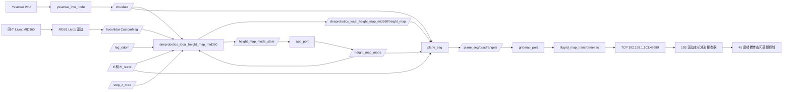
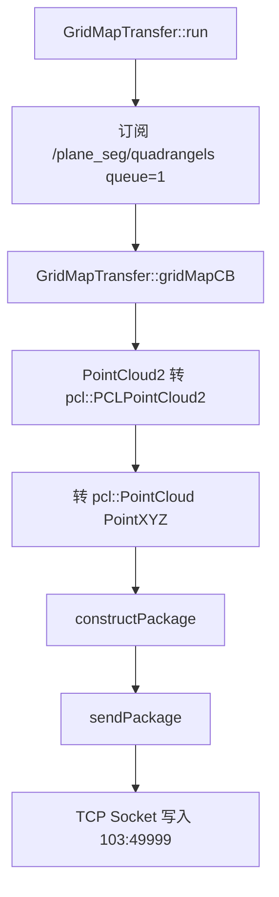
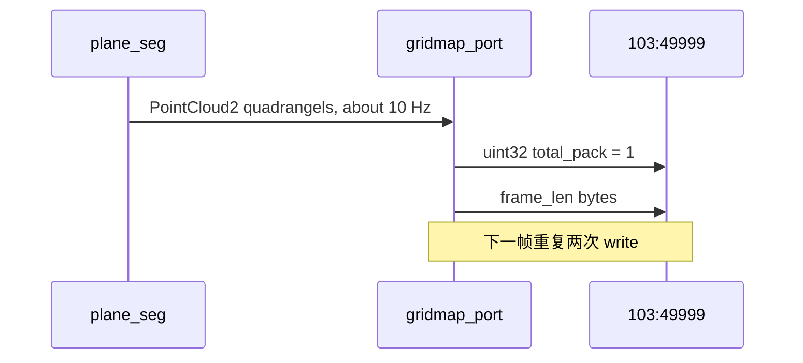
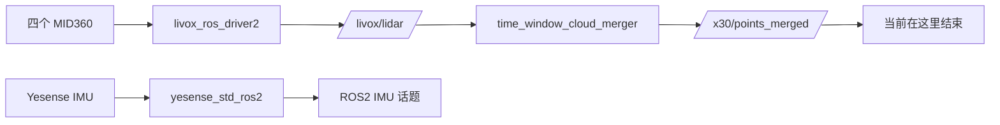
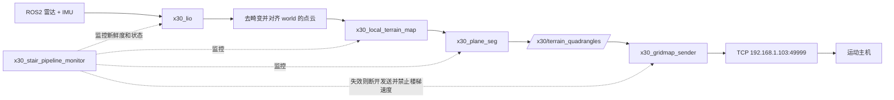

# X30 45 度楼梯 ROS1 原厂链路与 ROS2 Docker 实现图解

更新时间：2026-07-14  
项目路径：`D:\Desktop\RoboDog`

## 1. 先说结论

当前已经确认：

```text
1. 原厂发送给运动主机的 49999 地形链使用 TCP，不是 UDP。
2. gridmap_port 不处理原始雷达，也不执行 LIO 或平面检测。
3. gridmap_port 订阅 /plane_seg/quadrangels。
4. 该话题是 world 坐标系下的 XYZ float32 点集，约 10 Hz。
5. libgrid_map_transformer.so 只负责 PointCloud2 -> PointXYZ -> TCP 构包发送。
6. 当前 TCP 帧格式已经通过共享库静态分析和真机抓包相互验证。
```

所以现在最重要的工程判断是：

```text
libgrid_map_transformer.so 可以复用，但它是 ROS1/Noetic 共享库。
纯 ROS2 Humble Docker 不建议直接加载它。

推荐方案：
  在 ROS2 中实现一个等价的 x30_gridmap_sender。
  Docker 最终只需生成与原厂 /plane_seg/quadrangels 等价的数据，
  再按已恢复的 TCP 格式发送到 192.168.1.103:49999。

当前真正未完成的核心：
  LIO/重力对齐 -> 局部地形 -> 平面四边形提取。
```

## 2. 本次文件在哪里

从 `192.168.1.105` 下载的抓包已经位于：

```text
D:\Desktop\RoboDog\x30_gridmap_captures\20260714_132556_factory_idle.pcap
D:\Desktop\RoboDog\x30_gridmap_captures\20260714_132556_factory_idle.packets.txt
D:\Desktop\RoboDog\x30_gridmap_captures\20260714_132556_factory_idle.hex.txt
```

共享库位于：

```text
D:\Desktop\RoboDog\libgrid_map_transformer.so
```

本地 SHA256 与 105 输出一致：

```text
pcap:
  DD1B136358A761DC60AC04072C76D9C7EC207FF9B69E9862307329EF5384C75B

packets.txt:
  707692A5DD9DCF8B8F3762ABEE8C7309ED3DC03F358A3AD2D4B87C19C66689CA

hex.txt:
  1F57B41A98B3671BE4BA5D12F6C8CE382F6DC9F4FBD3E2C7C806D26FF93D0CA7

libgrid_map_transformer.so:
  5669EB5B5F2FA6590AE5EDE825541A3E43BC02CE7AEFFE8693085D03272DFE36
```

## 3. 原厂 ROS1 链路

### 3.1 链路总图

下面实线表示真机已经直接确认的关系，虚线表示仍需继续读取上游节点确认的关系。



### 3.2 已确认的节点和话题

| 组件 | 已确认内容 | 当前职责判断 |
|---|---|---|
| ROS1 Livox 驱动 | 发布 `/livox/lidar`，类型为 `livox_ros_driver2/CustomMsg` | 提供 Livox 原始点数据和逐点时间信息 |
| `yesense_imu_node` | 发布 `/imu/data`，约 200 Hz | 提供姿态、角速度、加速度 |
| `transfer_receiver` | 发布 `/leg_odom` 和 `/step_z_max` | 提供腿部里程计和最大台阶高度配置 |
| `deeprobotics_local_height_map_mid360` | 直接订阅 Livox CustomMsg、IMU、腿部里程计、TF 和模式；发布多个 GridMap 和障碍点云 | 对原始点数据进行坐标补偿并生成机器人附近的局部高度地图 |
| `app_port` | 按事件发布 `/height_map_mode`，并订阅 `/height_map_mode_state` | 下发高度图模式并接收当前状态 |
| `plane_seg` | 订阅高度图、IMU、TF 和模式，发布 `/plane_seg/quadrangels` | 生成并筛选地形平面四边形 |
| `gridmap_port` | 订阅 `/plane_seg/quadrangels` | 调用共享库构包并建立 TCP 连接 |
| `libgrid_map_transformer.so` | 包含 `gridMapCB()`、`constructPackage()`、`sendPackage()` | 转换 PointXYZ、加时间字段、发送 TCP |
| 103 运动主机 | 监听 TCP `49999` | 消费平面/落脚地形数据 |

注意：`gridmap_port` 不等于完整地形算法。局部高度图生成和平面检测发生在它的上游。真机连接已经确认原厂高度图节点直接使用 `/livox/lidar`、`/imu/data`、`/leg_odom`、TF 和 `/step_z_max`；当前连接中没有显示独立的 fast-lio 作为高度图直接上游。其内部如何利用腿部里程计完成运动补偿仍需分析参数和二进制。

### 3.3 高度图模式命令和状态

`/height_map_mode` 是 `app_port` 发布的模式命令，通常只在模式发生变化时发送；`/height_map_mode_state` 是高度图节点持续发布的当前状态。根据《绝影X30接口规格书（对外）ros+udp V1.0.4》第 42-44 页：

| 数值 | 官方含义 |
|---:|---|
| 3 | 实心地面 |
| 4 | 镂空地面 |
| 5 | 无踢面楼梯 |
| 18 | 累积帧准备状态 |
| 20 | 累积帧 |

2026-07-14 真机连续读取到：

```text
/height_map_mode_state = 3
```

表示当前原厂地形图处于普通实心地面模式。该模式状态与机器人步态状态不是一回事：高度图模式决定感知算法怎样解释地面，`robot_gait_state` 决定运动主机采用哪种步态。

规格书要求切换累积帧时先让机器人静止，开启激光里程计，再发布 `20`，等待状态先进入 `18` 并最终稳定为 `20`。不能在缺少这套状态机时直接手动发布 `20`。

### 3.4 小白理解：为什么用四边形描述地面

原始点云像是在物体表面撒了大量小点：

```text
台阶表面原始点云：

  . . . . . . . .
  . . . . . . . .
            . . . . . .
            . . . . . .
```

这些点有噪声，数量很多，而且没有直接告诉运动主机“哪一块是完整、平坦、可落脚的区域”。原厂先把点云整理成高度图，再找出高度接近、法向合适的平面区域。

一个检测出的平面区域可能包含几百个点。为了降低数据量并明确边界，可以只保留它的四个角：

```text
P0 ---------------- P1
 |                    |
 |    检测到的平面    |
 |                    |
P3 ---------------- P2
```

这四个点同时表达：

```text
高度：四个点的 z
方向：由点计算平面法向
范围：四条边围成的区域
大小：四边形的长、宽和面积
```

三个不共线点已经可以确定一个无限平面，第四个点主要帮助描述有限边界。运动主机需要的不是“地面无限延伸”，而是“这块明确边界内的区域可以作为候选支撑面”。

楼梯可以近似为多块不同高度的水平四边形：

```text
侧视图：

                     +---------+  第三级踏面
               +-----+
         +-----+                   第二级踏面
   +-----+
---+                             第一级踏面/地面
```

俯视每一级踏面时，都可以用一个或多个四边形描述。运动主机可根据平面高度、方向、边界和当前腿的位置，判断一个候选脚点是否落在支撑区域内。

严格来说，不能现在就写成“每个真实平面一定只对应一个四边形”。一个很大的或不规则平面可能被拆成多个四边形；过小、过陡或不可靠的平面也可能被过滤。第一组重复点还说明协议可能允许退化四边形或特殊标记。

### 3.5 `/plane_seg/quadrangels` 已确认格式

```text
消息类型：sensor_msgs/PointCloud2
frame_id：world
height：1
字段：x/y/z
字段类型：FLOAT32
字段偏移：0/4/8
频率：约 10 Hz
width：动态变化，已观察到 16、24，并从 TCP 帧推得 12 到 44
```

最新一次 `width=16` 的点可以按每 4 点先分组观察：

```text
候选组 0：点 0..3
  存在重复点，且 z 不一致；可能是退化平面、特殊标记或尚未理解的排列。

候选组 1：点 4..7
  四点 z 均约 -0.693081，外形接近水平四边形。

候选组 2：点 8..11
  四点 z 均约 -0.509875，外形接近水平四边形。

候选组 3：点 12..15
  四点 z 均约 -0.773069，外形接近水平四边形。
```

结合话题名 `quadrangels`、点数总是 4 的倍数以及后三组几何关系，“每 4 点表示一个地形平面四边形”已经是强假设。第一组的重复点说明目前不能直接假定每组都一定是正常可落脚矩形，还需确认：

```text
1. 四个顶点是顺时针还是逆时针。
2. 退化四边形是否表示边界、无效面或特殊状态。
3. 输出是否只包含可落脚面，还是还包含障碍/边界面。
4. world 原点、轴方向、单位和机器人位姿之间的关系。
```

## 4. `libgrid_map_transformer.so` 到底做了什么

共享库是 x86-64 ROS1/Noetic C++ 库，带调试符号且未剥离。它依赖：

```text
libroscpp.so
librosconsole.so
libroscpp_serialization.so
libpcl_common.so.1.10
```

核心调用链：



它没有执行：

```text
雷达接收
点云拼接
点云去畸变
LIO 定位
重力对齐
局部高度图
平面分割
楼梯平面筛选
```

## 5. 已恢复的 49999 TCP 帧

### 5.1 发送时序



### 5.2 单帧布局

所有整数和浮点数均按当前 x86 真机的小端序发送：

```text
先发送：
  uint32_t total_pack = 1

再发送 frame_len 字节：
  uint32_t frame_len             // 含自身，40 + N * 12
  uint32_t head_id = 12345       // 0x00003039
  uint32_t layer_size = 1
  uint32_t points_size = N * 12

  重复 N 次：
    float x
    float y
    float z

  float time_count_ms
  uint32_t source_stamp_sec
  uint32_t source_stamp_nsec
  uint32_t pack_time_sec
  uint32_t pack_time_nsec
  uint32_t end_id = 54321        // 0x0000D431
```

可以画成：

```text
TCP write 1                         TCP write 2
+-------------------+              +-----------+---------+-------+-------------+
| total_pack = 1    |              | frame_len | 12345   | ...   | 54321       |
| uint32, 4 bytes   |              | 4 bytes   | 4 bytes | XYZ   | final 4 B   |
+-------------------+              +-----------+---------+-------+-------------+
```

### 5.3 抓包与静态分析已经对上

15 秒静止抓包得到 284 个目标方向 TCP 数据段，恰好是 142 组“两次写入”：

```text
4 字节 total_pack 数据段：142 个
完整 frame 数据段：       142 个
平均完整帧频率：          约 9.47 Hz
```

完整帧长度分布：

| frame_len | 帧数 | 推导 N | 若每 4 点一组 |
|---:|---:|---:|---:|
| 184 | 7 | 12 | 3 组 |
| 232 | 20 | 16 | 4 组 |
| 280 | 47 | 20 | 5 组 |
| 328 | 36 | 24 | 6 组 |
| 376 | 16 | 28 | 7 组 |
| 424 | 9 | 32 | 8 组 |
| 472 | 4 | 36 | 9 组 |
| 520 | 2 | 40 | 10 组 |
| 568 | 1 | 44 | 11 组 |

所有 N 都是 4 的倍数，进一步支持四点一组的判断。

## 6. 我们能不能直接调用共享库

### 6.1 在 ROS1 中可以

最直接的复用方式不是自己 `dlopen()`，而是继续运行原厂 `gridmap_port`：

```text
发布 ROS1 /plane_seg/quadrangels
  -> 原厂 gridmap_port
  -> libgrid_map_transformer.so
  -> 103:49999
```

这样只要我们提供完全正确的 ROS1 `PointCloud2`，原厂库会完成构包发送。

### 6.2 在纯 ROS2 Humble Docker 中不建议直接调用

原因不是文件不能复制，而是 ABI 和运行时边界：

```text
1. 回调参数是 ROS1 sensor_msgs::PointCloud2 的 C++ 类型。
2. 库内部创建 ros::NodeHandle，并硬编码订阅 ROS1 话题。
3. 依赖 ROS1 Noetic roscpp 和 PCL 1.10。
4. 当前 Docker 是 ROS2 Humble，消息类型和执行器不是同一套 ABI。
5. 即使把 ROS1 运行时塞进同一镜像，仍然没有解决 quadrangels 如何生成。
```

理论上可以做一个同时包含 ROS1 和 ROS2 的混合镜像，再运行原厂 `gridmap_port`，但会增加依赖冲突、镜像体积和迁移风险，也与“纯 ROS2 单容器”的最终目标不一致。

### 6.3 推荐选择

```text
不直接调用 libgrid_map_transformer.so。
在 ROS2 中重写 x30_gridmap_sender。
```

发送函数本身很小，而且协议已经恢复。这样不修改 `RobotHardwareInterface`，也不依赖 ROS1 bridge。

## 7. Docker 目前做到哪里

当前 `x30_livox_ros2_transfer` 的有效链路是：



`time_window_cloud_merger` 只在时间窗口内合并点云消息字节。它没有完成去畸变、定位、重力对齐、局部地形或平面四边形提取，因此 `/x30/points_merged` 不能直接送到 `103:49999`。

## 8. 完全 ROS2 Docker 的目标链路



建议模块职责：

| 模块 | 输入 | 输出 | 关键工作 |
|---|---|---|---|
| `x30_lio` | 四雷达原始数据、IMU | 位姿、去畸变点云 | 时间同步、外参、重力方向、world 坐标 |
| `x30_local_terrain_map` | 位姿、去畸变点云 | 机器人附近局部地形 | 滑动窗口、高度统计、滤除动态/离群点 |
| `x30_plane_seg` | 局部地形 | 四边形平面集合 | 平面分割、边界拟合、可落脚区域筛选、顶点排序 |
| `x30_gridmap_sender` | 四边形点和时间戳 | TCP `103:49999` | 原厂兼容构包、重连、频率控制 |
| `x30_stair_pipeline_monitor` | 全链状态 | 放行/禁止信号 | 数据超时、坐标跳变、空地图、连接异常联锁 |

## 9. 最后做到哪一步就够了

有两种终点：

### 方案 A：保留原厂 ROS1 `gridmap_port`

Docker/算法只需要生成：

```text
与原厂完全等价的 /plane_seg/quadrangels
```

然后还要解决 ROS2 到 ROS1 的低带宽消息交付。该方案不桥接原始点云，但仍不是纯 ROS2，并且用户当前要求不使用 bridge，因此不作为最终方案。

### 方案 B：完全 ROS2，推荐

Docker 需要完成到：

```text
正确的四边形平面点集
  + 正确的 world 坐标和时间戳
  + 原厂兼容 TCP 帧
  + 约 10 Hz 持续发送到 192.168.1.103:49999
```

做到这一步，地形数据面就接到了运动主机。山地/楼梯步态切换和速度控制仍由 `robot_hardware` 的 `writeActionCommand()`、`writeRobotVelocityCommand()` 负责，两条职责不要混到一起。

## 10. 现在还不能直接写 sender 上机的原因

TCP 字节格式已基本不是阻塞，剩余风险集中在语义层：

```text
1. /plane_seg 的准确上游输入和参数尚未完整获取。
2. 每 4 点的准确顶点顺序尚未确认。
3. 第一组重复点的含义未知。
4. 哪些平面会被保留为可落脚面尚未确认。
5. world 坐标系原点、轴方向和机器人位姿关系尚未确认。
6. 103 对断流、空帧、错误帧和时间戳回退的处理未知。
```

如果四边形几何语义错误，即使 TCP 包逐字节正确，运动主机也可能得到错误落脚面。因此在完成离线比对前，不能向真机发送自制地形帧。

## 11. 推荐实施顺序

### 阶段 1：补齐原厂语义基准

在 105 上只读获取：

```bash
source /opt/ros/noetic/setup.bash
source /home/ysc/jy_cog/drivers/setup.bash 2>/dev/null || true
source /home/ysc/jy_cog/system/devel/setup.bash 2>/dev/null || true

rosnode info /plane_seg
rostopic info /plane_seg/quadrangels
```

然后分别在以下静止场景记录 `/plane_seg/quadrangels` 和 TCP 抓包：

```text
1. 平整地面。
2. 前方放一个尺寸已知的低台阶。
3. 前方放两个高度已知的台阶。
4. 斜坡或不可落脚障碍。
```

这一步不需要进入楼梯步态，也不需要发送速度命令。

### 阶段 2：先实现离线协议编解码器

在 `x30_livox_ros2_transfer/ws/src` 新增：

```text
x30_gridmap_protocol
```

先做：

```text
pcap TCP 流重组
-> 解码原厂帧
-> 输出每帧 N、XYZ、时间戳
-> 重新编码
-> 与原始字节逐字节比较
```

这一阶段 sender 禁止连接真机。

### 阶段 3：实现/集成 LIO 和局部地形

优先集成成熟的 ROS2 LIO 核心，再完成 X30 四雷达外参、时间同步和运动补偿，不手写未经验证的里程计算法。

验收条件：

```text
静止时 world 点云不漂移或漂移可控。
移动时墙面和台阶不出现明显重影。
重力方向稳定，地面法向接近竖直轴。
```

### 阶段 4：复刻 `plane_seg` 输出语义

先在录制数据上离线运行，与原厂同一时刻的四边形结果比较：

```text
四边形数量
平面高度
平面法向
边界范围
顶点顺序
更新频率
```

### 阶段 5：实现 ROS2 sender，但先接本地假服务器

本地 TCP 假服务器检查每一帧：

```text
head_id/end_id
frame_len/points_size
N 是否为 4 的倍数
所有 float 是否有限
时间戳是否单调
发送频率是否约 10 Hz
断线是否安全重连
```

### 阶段 6：真机静止接入

只有离线数据和假服务器全部通过后：

```text
1. 机器人静止，手柄在旁。
2. 不进入 45 度楼梯步态。
3. 停止原厂 gridmap_port，确保 49999 只有一个发送者。
4. 启动 Docker sender，只发送已验证的静态地形流。
5. 监控连接、状态和超时，不发送速度。
6. 失败立即停止 Docker sender，并恢复原厂地形链。
```

原厂 ROS1 不能笼统全部关闭。最终替换时只关闭与 Docker 冲突的传感器和地形链；状态回传、APP 控制以及 `udp_receiver/app_port` 等节点是否保留，要按节点职责逐项确认。

## 12. 当前工程分工不变

```text
robot_hardware
  负责：初始化控制、速度、动作、步态、安全联锁
  不负责：LIO、局部地形图、平面分割

x30_livox_ros2_transfer
  负责：ROS2 传感器、LIO、局部地形、平面四边形、TCP 地形发送

RobotHardwareInterface
  不需要修改抽象协议。
```

下一项最有价值的工作不是立即发送自制 TCP 包，而是先取得 `rosnode info /plane_seg`，并在“平地 + 已知尺寸台阶”场景同步记录 ROS1 四边形话题和 49999 TCP 数据。这样才能把目前的强假设变成可用于真机控制的确定协议。

## 13. 是否需要完整复现原厂处理

如果最终关闭原厂 ROS1 传感器和地形节点，由 ROS2 Docker 独占雷达与 IMU，那么必须复现原厂地形链的功能，但不要求逐行复制原厂实现。

需要达到的是功能等价：

```text
相同或等价的传感器输入
  -> 得到足够一致的局部高度图
  -> 选择足够一致的可落脚平面
  -> 生成运动主机能够正确理解的四边形
  -> 按完全兼容的 TCP 格式和频率发送
```

兼容性分成四层：

| 层级 | 必须一致的内容 | 当前状态 |
|---|---|---|
| TCP 字节协议 | 包头、长度、XYZ、时间戳、结尾、大小端 | 基本恢复，已有真机 pcap 基准 |
| 几何协议 | `world` 坐标系、米制单位、四点分组、顶点顺序、退化组 | 部分确认，仍需已知台阶场景 |
| 地形语义 | 哪些平面可落脚、哪些要过滤、台阶边界和高度 | 尚未复现，是当前核心难点 |
| 时序与安全 | 约 10 Hz、数据新鲜度、断流、模式 18/20、失败恢复 | 尚未完整实现 |

不能采用以下简化：

```text
/x30/points_merged
  -> 随便取四个点
  -> TCP 103:49999
```

这种数据即使字节格式正确，也可能把墙面、台阶立面、空洞或噪声当成支撑面，属于危险的语义错误。

原厂当前可见处理链为：

```text
/livox/lidar CustomMsg
+ /imu/data
+ /leg_odom
+ TF
+ /step_z_max
  -> deeprobotics_local_height_map_mid360
  -> height_map / cleanup / fused / safety
  -> plane_seg
  -> received_cloud / voxel_cloud / hull_cloud
  -> quadrangels
  -> gridmap_port
  -> TCP 103:49999
```

内部实现的合理工程复现可以使用不同算法。例如 ROS2 中可以使用成熟的运动补偿/定位组件、`grid_map` 数据结构、PCL 平面分割和凸包算法；只要最终通过原厂录制数据的离线对照和真机静止验证即可。

在开始实现前必须建立同步基准数据集：同一时段同时记录原厂输入、原厂中间结果和原厂输出。至少包含：

```text
/livox/lidar
/imu/data
/leg_odom
/tf
/tf_static
/height_map_mode_state
/deeprobotics_local_height_map_mid360/height_map
/plane_seg/voxel_cloud
/plane_seg/hull_cloud
/plane_seg/quadrangels
以及 105 -> 103:49999 TCP pcap
```

建议分别采集平地、单级已知尺寸台阶、多级楼梯、斜坡和不可落脚障碍。先用 ROS bag 离线重放验证，不在真机运动中调算法。

## 14. 实心地面模式同步基准采集

2026-07-14 在 105 上、机器人静止、`height_map_mode_state=3` 条件下完成第一组同步基准。

ROS bag：

```text
/home/ysc/x30_stair_baselines/mode3_flat_20260714_142726.bag
duration: 14.1 s
size: 255.0 MB
messages: 7299
compression: none
```

主要消息数量：

| 话题 | 消息数 | 约频率 |
|---|---:|---:|
| `/livox/lidar` | 141 | 10 Hz |
| `/deeprobotics_local_height_map_mid360/height_map` | 141 | 10 Hz |
| `/height_map_mode_state` | 142 | 10 Hz |
| `/plane_seg/received_cloud` | 142 | 10 Hz |
| `/plane_seg/voxel_cloud` | 142 | 10 Hz |
| `/plane_seg/quadrangels` | 142 | 10 Hz |
| `/imu/data` | 2828 | 约 200 Hz |
| `/leg_odom` | 2820 | 约 200 Hz |
| `/tf` | 795 | 约 56 Hz |
| `/tf_static` | 6 | 静态变换 |

`/plane_seg/hull_cloud` 虽然 rosbag 已订阅，但本次没有收到消息，因此没有出现在 bag 的话题列表中。核心输入、高度图、体素点云、四边形和 TF 均已完整记录，不影响第一轮离线分析。

同步 TCP 抓包：

```text
/home/ysc/x30_gridmap_captures/20260714_142726_mode3_flat_20260714_142726.pcap
duration: 18 s
packets captured: 344
packets dropped: 0

pcap SHA256:
5d185a9fbe9e1fd4d7b903085bdad1547ff866e4ae16009e72dfb5f3eec4cc91

packet summary SHA256:
a058b28ecd1eb51a6a07869af088ed7592f9f72e3284a0f4c196b7ceb5dd029c

hex dump SHA256:
ff57feee5a8c2f43650cd3e1bf1c1cc2c65afc244e9e513256f3d0a31229dd43
```

本组数据是“实心地面模式 3”的原厂标准答案。下一步先生成 bag 的 SHA256 并下载全部文件到 Windows，再进行离线解析；下载校验完成前不切换模式 20。

2026-07-14 已下载并完成本地校验：

```text
D:\Desktop\RoboDog\x30_stair_baselines\mode3_flat_20260714_142726.bag
size: 267376372 bytes
SHA256: 9A10296098FEFDD9A969ED56892896BB1DF13A2E7175194053660DA98E3C0484

D:\Desktop\RoboDog\x30_stair_baselines\mode3_flat_20260714_142726.info.yaml
D:\Desktop\RoboDog\x30_stair_baselines\mode3_flat_20260714_142726.bag.sha256
```

本地 bag 哈希与 105 生成的哈希完全一致。同步下载的 pcap、packet summary 和 hex dump 哈希也分别与抓包输出一致，因此该组基准文件传输完整，可以进入离线解析阶段。

## 15. 模式 3 平地基线离线解析结果

2026-07-14 已新增纯 Python 标准库分析工具：

```text
x30_livox_ros2_transfer/tools/analyze_x30_gridmap_baseline.py
x30_livox_ros2_transfer/tests/test_gridmap_baseline_analyzer.py
```

本地执行命令：

```powershell
cd D:\Desktop\RoboDog

python .\x30_livox_ros2_transfer\tools\analyze_x30_gridmap_baseline.py `
  --bag .\x30_stair_baselines\mode3_flat_20260714_142726.bag `
  --pcap .\x30_gridmap_captures\20260714_142726_mode3_flat_20260714_142726.pcap `
  --output .\x30_stair_baselines\analysis\mode3_flat_20260714_142726
```

生成结果：

```text
x30_stair_baselines/analysis/mode3_flat_20260714_142726/summary.json
x30_stair_baselines/analysis/mode3_flat_20260714_142726/quadrangle_frames.csv
x30_stair_baselines/analysis/mode3_flat_20260714_142726/quadrangle_groups.csv
x30_stair_baselines/analysis/mode3_flat_20260714_142726/tcp_frames.csv
```

已确认：

```text
ROS /plane_seg/quadrangels 帧数：142
TCP 抓包完整帧数：172
按 ROS 源时间戳匹配：142 / 142
匹配帧点数一致：142 / 142
匹配帧 XYZ 最大误差：0.0
TCP 源数据周期中位数：100.010 ms，约 10 Hz
源时间戳到封包时间戳延迟中位数：54.014 ms
```

这证明当前原厂链路中：

```text
/plane_seg/quadrangels
  -> gridmap_port / libgrid_map_transformer.so
  -> 添加 TCP 帧头、长度、时间戳和帧尾
  -> XYZ float32 点保持不变
  -> 192.168.1.103:49999
```

当前恢复的 TCP 小端序帧结构为：

```text
uint32 total_pack                  固定为 1
uint32 frame_len
uint32 head_id                     固定为 12345
uint32 layer_size                  固定为 1
uint32 points_size                 点数 * 12
float32 points[][3]                x, y, z
float32 time_count_ms
uint32 source_stamp_sec
uint32 source_stamp_nsec
uint32 pack_time_sec
uint32 pack_time_nsec
uint32 end_id                      固定为 54321
```

四边形结构统计：

```text
142 帧的点数全部是 4 的倍数。
总四点组：828。
正常非退化四边形：686。
特殊退化组：142，恰好每帧一个，而且总是第 0 组。
第 0 组中 p2 与 p3 始终完全相同。
第 1 组及之后没有退化四边形。
```

因此第 0 组不能作为普通支撑平面使用。它很可能是 `plane_seg` 编入的控制或姿态元信息，但仅凭平地数据还不能给出确定语义。ROS2 复现阶段必须先识别该组含义，不能简单丢弃或伪造。

## 16. 下一步：静止已知台阶对照基线

下一步先不切换模式 20、不进入 45 度楼梯步态、不发送速度。把机器人静止放在一个尺寸已测量的单级台阶前，保持 `/height_map_mode_state=3`，同步记录原厂中间结果与 TCP 输出。

新增只读同步采集脚本：

```text
robot_hardware/robot_hardware/scripts/x30_capture_stair_baseline.sh
```

从 Windows 传到 105：

```powershell
cd D:\Desktop\RoboDog
scp .\robot_hardware\robot_hardware\scripts\x30_capture_stair_baseline.sh `
  ysc@192.168.1.105:/home/ysc/
```

在 `192.168.1.105` 上执行。以下尺寸必须改成现场实测值：

```bash
chmod +x /home/ysc/x30_capture_stair_baseline.sh

X30_SCENE_DESCRIPTION=single_known_step \
X30_SCENE_STEP_HEIGHT_M=0.15 \
X30_SCENE_STEP_DEPTH_M=0.30 \
X30_SCENE_STEP_WIDTH_M=1.00 \
X30_SCENE_ROBOT_DISTANCE_M=1.00 \
bash /home/ysc/x30_capture_stair_baseline.sh 15 mode3_known_step
```

脚本只订阅 ROS1 话题并被动抓取 TCP，不发布 ROS 命令，不切换模式、步态或速度。采集期间机器人必须保持静止。

这组数据完成后，重点比较：

```text
1. 正常四边形的 z 高度是否出现与实测台阶高度一致的分层。
2. 每四个顶点的顺序和法向方向。
3. 第 0 特殊组与 /plane_seg/look_pose、/test_rqy 的关系。
4. 台阶立面是否被过滤，只保留可落脚水平面。
5. ROS quadrangels 与 TCP 是否仍保持逐点完全一致。
```

只有“模式 3 平地”和“模式 3 已知台阶”都解析清楚后，再采集模式 5 或模式 18/20 的对照数据。现阶段不要实现或向 `103:49999` 发送自制地形流。

2026-07-14 已覆盖固定名称传输包，没有创建新的日期后缀包：

```text
D:\Desktop\RoboDog\robot_hardware_x30_udp_transfer.tar.gz
size: 359484 bytes
SHA256: A6961ABC659C5A69219A1252FCBDB5AB432878DDE528F55E3A4C1545703F505D

D:\Desktop\RoboDog\x30_livox_ros2_transfer.tar.gz
size: 641494 bytes
SHA256: 17960EE8BAF1C021F329D768CA90A2BF0C7F0103CEE7AD43F2FC8CFCA79F28A4
```

两个归档均排除了本地 `build`、`install`、`log` 和 `__pycache__`，机器狗上仍按现有流程重新构建。

## 17. 模式 3 第二组平地重复采集结果

2026-07-14 在 105 上完成第二组只读同步采集。采集时误用了 `mode3_known_step` 标签，事后确认现场没有放置台阶或其他物体，因此该组数据的正确分类是 `mode3_flat_repeat`。

```text
height_map_mode_state before: 3
height_map_mode_state after: 3
duration: 15 s

ROS bag:
/home/ysc/x30_stair_baselines/mode3_known_step_20260714_150324.bag
SHA256: dbe7838b2291fa4d4122a042588a5de3a34ae69f23578879e6934dce49ecf423

TCP pcap:
/home/ysc/x30_gridmap_captures/20260714_150324_mode3_known_step.pcap
packets captured: 364
packets dropped: 0
SHA256: 1fb84d4b59d42dec1c5e2662d96161243d15a236cb5f32357ab27c09f72e9cc4
```

采集结束时，Noetic 的 Python `rosbag` 命令外壳在接收 `SIGINT` 后打印：

```text
TypeError: 'Handlers' object is not callable
```

该异常发生在 15 秒记录完成后的外壳退出处理阶段。随后 `rosbag info --yaml` 成功生成 info 文件，并成功读取 bag 计算 SHA256，说明 bag 已关闭、索引且可读；本次数据不需要因此重采。

本地同步采集脚本已改为优先直接调用：

```text
/opt/ros/noetic/lib/rosbag/record
```

从而绕开 Python 外壳的退出信号处理问题。下一次更新脚本到 105 后将不再出现这段无害的 Traceback。

## 18. 平地重复基线本地分析

文件下载后的本地 SHA256 与 105 输出完全一致：

```text
bag:  DBE7838B2291FA4D4122A042588A5DE3A34AE69F23578879E6934DCE49ECF423
pcap: 1FB84D4B59D42DEC1C5E2662D96161243D15A236CB5F32357AB27C09F72E9CC4
```

bag 可正常读取并已建立索引：

```text
duration: 14.240705 s
size: 271401171 bytes
messages: 13317
indexed: true
quadrangels: 142
look_pose: 142
height_map: 142
```

ROS 四边形与 TCP 再次完全对齐：

```text
匹配时间戳：142 / 142
点数与 XYZ 一致：142 / 142
最大坐标误差：0.0
TCP 完整帧：182
TCP 报文：364，丢包 0
```

与平地基线比较：

| 指标 | 模式 3 平地 | 本次 `mode3_flat_repeat` |
|---|---:|---:|
| 正常四边形 | 686 | 714 |
| 水平四边形 | 680 | 705 |
| 主要 Z 高度层 | -0.50 m | -0.50 m |
| 最高四边形均值 Z | -0.5034 m | -0.5030 m |
| 预期 `-0.35 ± 0.03 m` 台阶顶面 | 0 组 | 0 组 |
| 含 `0.15 ± 0.03 m` 高差的帧 | 115 / 142 | 115 / 142 |

对照报告：

```text
x30_stair_baselines/analysis/mode3_flat_vs_flat_repeat_20260714.json
```

中间点云同样没有出现新的 15 cm 高台阶层：

```text
平地 received_cloud Z: -0.8315 .. -0.4362 m，591360 点
本次 received_cloud Z: -0.8325 .. -0.4359 m，591947 点

平地 voxel_cloud Z:   -0.8315 .. -0.4362 m，223988 点
本次 voxel_cloud Z:   -0.8325 .. -0.4359 m，224140 点
```

`/plane_seg/look_pose` 的 142 帧时间戳均为 0，位置恒为 `(0,0,0)`，姿态恒为 `(-0.5,0.5,-0.5,0.5)`，是未填充的占位输出，不能解释第 0 特殊四点组。

现场已确认没有放置任何物体，所以“没有形成台阶特征”是正确结果，不是算法漏检。本组数据正式归类为“模式 3 平地重复静止采集”，可用于验证原厂输出稳定性，但不能作为台阶算法标准答案。

Windows 本地文件已更名为：

```text
x30_stair_baselines/mode3_flat_repeat_20260714_150324.*
x30_gridmap_captures/20260714_150324_mode3_flat_repeat.*
x30_stair_baselines/analysis/mode3_flat_repeat_20260714_150324/
```

元数据保留了原始误标签和当时输入的示例尺寸，同时明确写入 `classification_note=no_physical_object_was_placed_during_capture`。bag 与 pcap 内容及 SHA256 没有改变。

下一次真正采集台阶时，必须使用实物、实测尺寸和距离，并同时保存现场照片与机器人朝向，再运行相同的只读同步采集流程。

## 19. 未知尺寸物体探测结果

2026-07-14 在机器人前方约 1 m 放置一个尺寸未测量的稳定物体，并保持机器人静止、`height_map_mode_state=3`，完成同步采集：

```text
bag:
x30_stair_baselines/mode3_object_probe_20260714_153211.bag
SHA256: D6E240E3024B13184C05411F90C4EB2DD9727BE1079D1ADE67E0FE8490ED2391

pcap:
x30_gridmap_captures/20260714_153211_mode3_object_probe.pcap
SHA256: DE6CA3C2B0C5BB3C098BCA3046FD3D762F360E582899492FCB9B65851B027971
```

bag 为 ROS bag 2.0、已索引、无压缩，时长 `14.156989 s`，共 `13253` 条消息。高度图、四边形和中间点云均为 141 帧。

协议验证：

```text
ROS quadrangels: 141 帧
按源时间戳匹配 TCP: 141 / 141
XYZ 完全一致: 141 / 141
最大坐标误差: 0.0
TCP 完整帧: 182
TCP 报文: 364，丢包 0
```

物体相对紧邻采集的 `mode3_flat_repeat` 已产生明显变化：

| 指标 | 平地重复 | 放置物体 |
|---|---:|---:|
| 正常四边形总数 | 714 | 821 |
| 单帧最大 PointCloud2 点数 | 44 | 56 |
| 目标区域地面中位 Z | -0.766 m | - |
| 目标物体顶面中位 Z | - | -0.584 m |
| 推算抬高 | - | 约 0.182 m |

5 cm 体素占用率差分把主要新增区域定位为：

```text
x: 约 0.80 .. 1.15 m
y: 约 -0.20 .. 0.10 m
z: 约 -0.65 .. -0.55 m
```

最终四边形中筛出 106 个物体顶面候选，覆盖 102 / 141 帧，帧检出率约 72.3%。候选顶面中心中位数约为 `(1.07, -0.05) m`，顶面四边形中位范围约 `0.21 × 0.35 m`，中位面积约 `0.068 m²`。

完整空间分析结果：

```text
x30_stair_baselines/analysis/mode3_object_probe_spatial_summary_20260714.json
x30_stair_baselines/analysis/mode3_flat_vs_object_probe_20260714.json
```

结论：未知尺寸物体已经进入原厂 `received_cloud/voxel_cloud`，被 `plane_seg` 转换为水平四边形，并由 `gridmap_port` 原样封装发送到 `103:49999`。这证明从传感器到运动主机地形输入的完整原厂链路工作正常。

上述尺寸来自 5 cm 体素和拟合四边形，只是近似推算，不能替代尺子实测；该物体也不能据此认定为可落脚台阶，更不能让机器人直接攀爬。

## 20. 原厂 GridMap 四图层解析与正负对照

2026-07-14 已新增纯 Python 标准库离线工具：

```text
x30_livox_ros2_transfer/tools/analyze_x30_gridmap_layers.py
x30_livox_ros2_transfer/tests/test_gridmap_layer_analyzer.py
```

工具直接从 ROS bag 反序列化 `grid_map_msgs/GridMap`，不依赖 ROS1、ROS2 或第三方 Python 包。当前三组模式 3 记录中的地图结构一致：

```text
topic: /deeprobotics_local_height_map_mid360/height_map
frame_id: world
resolution: 0.03 m
length: 3.0 m x 3.0 m
matrix: 100 x 100
center: (0, 0, 0)
outer_start_index: 0
inner_start_index: 0
basic_layers: [elevation]
layers: [elevation, color, slope, accessibility]
```

四层语义当前可确定到：

| 图层 | 当前确认内容 | 仍不能假定的内容 |
|---|---|---|
| `elevation` | 单元格高程，空单元为 NaN | 不应离开当前坐标系直接复用 |
| `color` | 以 float32 携带 uint32 颜色位模式 | 不能按普通浮点数求平均 |
| `slope` | 原厂生成的坡度相关量 | 单位和阈值尚未从原厂参数确认 |
| `accessibility` | 主要出现 `0/0.022/0.1/1.0` 四类值 | 不能先验解释为概率或简单布尔值 |

本地执行正样本对照：

```powershell
python .\x30_livox_ros2_transfer\tools\analyze_x30_gridmap_layers.py `
  --reference-bag .\x30_stair_baselines\mode3_flat_repeat_20260714_150324.bag `
  --candidate-bag .\x30_stair_baselines\mode3_object_probe_20260714_153211.bag `
  --output-dir .\x30_stair_baselines\analysis\mode3_flat_repeat_vs_object_gridmap_20260714
```

采用每格至少覆盖一半采集帧、候选高程比平地中位值高 `0.08 m`、四邻域连通的判据，结果为：

| 指标 | 结果 |
|---|---:|
| 可比较格数 | 4151 |
| 正向高程变化格数 | 117 |
| 最大连通区域 | 110 格 |
| 最大区域面积 | 约 0.099 m² |
| 区域中心 | `(1.063, -0.050) m` |
| 区域边界 | `x=0.93..1.20 m, y=-0.24..0.15 m` |
| 高程增量中位数 | 0.199 m |
| 时间稳定检出 | 136 / 141 帧，96.45% |

该中心与 `/plane_seg/quadrangels` 独立计算的 `(1.07, -0.05) m` 一致，说明 GridMap 矩阵展开方向和物理坐标映射正确。

同时执行平地负对照：

```powershell
python .\x30_livox_ros2_transfer\tools\analyze_x30_gridmap_layers.py `
  --reference-bag .\x30_stair_baselines\mode3_flat_20260714_142726.bag `
  --candidate-bag .\x30_stair_baselines\mode3_flat_repeat_20260714_150324.bag `
  --output-dir .\x30_stair_baselines\analysis\mode3_flat_vs_flat_repeat_gridmap_20260714
```

负对照最大变化区只有 4 格、约 `0.0036 m²`，没有达到 20 格联锁阈值，结果为 `distinct_elevated_surface_detected=false`。正样本最大区域为 110 格，是负对照的 27.5 倍。

输出文件：

```text
reference_summary.json
candidate_summary.json
reference_cells.csv
candidate_cells.csv
positive_elevation_changes.csv
elevation_components.csv
gridmap_comparison.json
```

当前原厂链路应准确描述为：

```text
Livox + IMU + leg_odom + TF
  -> deeprobotics_local_height_map_mid360
  -> GridMap: elevation/color/slope/accessibility
  -> plane_seg
  -> /plane_seg/quadrangels (四点一组的支撑面表示)
  -> gridmap_port / libgrid_map_transformer.so
  -> TCP 192.168.1.103:49999
```

`GridMap` 四层不是直接发送给 `103:49999` 的协议载荷。完全 ROS2 Docker 复现至少要生成与原厂等价的局部高度和支撑面四边形，再按已恢复的 TCP 协议发送。当前仍禁止发送自制地形流或进行 45 度楼梯运动测试。

下一步必须采集一组有尺子实测高度、深度、宽度和机器人距离，并有现场照片的单级台阶静止基线。用相同工具同时验证 `elevation/slope/accessibility`、四边形顶点与 TCP 输出后，才能确定 ROS2 高度图和支撑面生成规则。

## 21. 实测单级台阶基线结果

2026-07-14 完成模式 3、机器人静止状态下的实测单级台阶同步采集：

```text
台阶高度: 0.22 m
台阶深度: 0.29 m
台阶宽度: 0.35 m
机器人距离: 1.00 m
height_map_mode_state: 采集前后均为 3
运动命令: 未发送
自制地形数据: 未发送
```

原始数据：

```text
bag:
x30_stair_baselines/mode3_measured_step_h022_d029_w035_20260714_160857.bag
size: 277838735 bytes
SHA256: DB43A9DE2AD8C030C43256761C269F9BF7CCE1798206A253229B55827102D4E6

pcap:
x30_gridmap_captures/20260714_160857_mode3_measured_step_h022_d029_w035.pcap
size: 100856 bytes
SHA256: 3FE37FB95C99BB3D93C2C779445CB1B04CC94CA2643586AEED69087F68C276E2
```

本地 SHA256 与 105 生成的校验文件完全一致。bag 已索引、无压缩，时长 `14.663065 s`，包含 147 帧高度图和 147 帧四边形。

### 21.1 GridMap 高程结果

相对于紧邻的 `mode3_flat_repeat` 平地基线，GridMap 检测结果为：

| 指标 | 结果 |
|---|---:|
| 可比较单元格 | 4161 |
| 正向高程变化单元格 | 74 |
| 连通区域数量 | 1 |
| 主区域面积 | 0.0666 m² |
| 主区域中心 | `(1.109, -0.060) m` |
| 主区域边界 | `x=1.02..1.20 m, y=-0.27..0.15 m` |
| 局部平地中位 Z | -0.793 m |
| 台阶顶面中位 Z | -0.589 m |
| 检测高差中位数 | 0.204 m |
| 相对实测 0.22 m 的误差 | -0.016 m |
| 稳定检出 | 123 / 147 帧，83.67% |

高程误差约 `1.6 cm`，在当前 `3 cm` 地图分辨率下合理。该结果证明 `elevation` 图层已经稳定编码这一级台阶。

### 21.2 局部四边形结果

旧的全局高度比较会错误选择场景中更大的 `z=-0.50 m` 平面。比较工具现已支持读取 GridMap 主连通区域，先定位局部台阶，再筛选四边形：

```text
GridMap 局部地面 Z: -0.793 m
按实测高度计算的预期顶面 Z: -0.573 m
候选顶面四边形: 90 个
覆盖帧: 90 / 147，61.22%
平地参考中的同区域顶面候选: 0
顶面 Z 中位数: -0.590 m
顶面 Z 相对预期误差: -0.0167 m
顶面中心中位数: (1.103, -0.060) m
```

四边形可见范围中位数：

```text
x 方向: 0.141 m，对应前后方向可见支撑深度
y 方向: 0.340 m，对应左右方向可见宽度
```

实测宽度为 `0.35 m`，四边形宽度仅少约 `0.01 m`；实测深度为 `0.29 m`，但四边形只保留约 `0.14 m`。因此 `/plane_seg/quadrangels` 表示经过视野、点云覆盖和安全筛选后的可见支撑片，不是台阶完整包围盒。ROS2 复现不能强行让四边形等于实物全尺寸。

### 21.3 TCP 发送一致性

```text
ROS quadrangels: 147 帧
按源时间戳匹配 TCP: 147 / 147
XYZ 逐点一致: 147 / 147
最大坐标误差: 0.0
TCP 完整帧: 182
bag 时间窗外 TCP 帧: 35
TCP 源周期中位数: 99.973 ms
封包延迟中位数: 55.500 ms
```

这证明实测台阶已完整经过：

```text
Livox/IMU/leg_odom/TF
  -> 原厂局部 GridMap
  -> plane_seg 支撑面筛选
  -> /plane_seg/quadrangels
  -> gridmap_port
  -> TCP 192.168.1.103:49999
```

分析结果：

```text
x30_stair_baselines/analysis/mode3_flat_repeat_vs_measured_step_h022_d029_w035_gridmap_20260714/
x30_stair_baselines/analysis/mode3_measured_step_h022_d029_w035_20260714_160857/
x30_stair_baselines/analysis/mode3_flat_repeat_vs_measured_step_h022_d029_w035_quadrangles_20260714.json
```

该台阶宽度仅 `0.35 m`，本组数据只用于协议和语义基线，不允许用于攀爬验证。下一阶段是离线复现 `GridMap -> quadrangels`，并使用这些 147 帧作为逐帧标准答案；在离线结果达到要求前，不进入模式 18/20，不向 `103:49999` 发送自制数据。

## 22. plane_seg 原厂实现只读取证

当前已经知道原厂输入、输出和主要 ROS 参数，但尚不知道 `plane_seg_ros` 的精确筛选、四边形裁剪、顶点排序和第 0 特殊四点组规则。直接根据样本猜算法容易得到“看起来像”，但不能保证运动主机看到的数据与原厂一致。

因此下一步先从 105 只读收集原厂节点证据：

```text
/plane_seg 节点信息和参数
正在运行的 plane_seg_ros 可执行文件
该进程实际加载的原厂共享库
相关 launch/yaml/xml/package 配置
ELF 动态依赖、符号和可读字符串
文件 SHA256
```

新增脚本：

```text
robot_hardware/robot_hardware/scripts/x30_collect_plane_seg_bundle.sh
```

本次已覆盖更新唯一传输包：

```text
D:\Desktop\RoboDog\robot_hardware_x30_udp_transfer.tar.gz
size: 360341 bytes
SHA256: AEA0953A9B5C34DF512F2A0C0CCE4DA9077073C24095E5E1B8C389D8078489F0
```

脚本只查询 ROS 图并复制 105 上可读文件；不发布 ROS 消息，不切模式，不切步态，不发速度和地形数据，也不停止任何进程。

Windows 上传：

```powershell
cd D:\Desktop\RoboDog
scp .\robot_hardware\robot_hardware\scripts\x30_collect_plane_seg_bundle.sh `
  ysc@192.168.1.105:/home/ysc/
```

105 上先检查 Bash 语法，再执行：

```bash
ssh ysc@192.168.1.105
bash -n /home/ysc/x30_collect_plane_seg_bundle.sh
chmod +x /home/ysc/x30_collect_plane_seg_bundle.sh
bash /home/ysc/x30_collect_plane_seg_bundle.sh
```

成功后会打印带时间戳的 `.tar.gz` 和 `.sha256`。下载回 Windows：

```powershell
cd D:\Desktop\RoboDog
New-Item -ItemType Directory -Force .\x30_plane_seg_bundle
scp "ysc@192.168.1.105:/home/ysc/x30_plane_seg_bundle_*.tar.gz*" `
  .\x30_plane_seg_bundle\
```

取回后按以下顺序推进：

```text
原厂二进制、配置和依赖静态分析
  -> 建立 plane_seg 参数和算法行为表
  -> 离线实现 GridMap -> quadrangels
  -> 使用 147 帧实测台阶逐帧比较
  -> 平地负对照和物体正对照回归
  -> 达标后再集成为 ROS2 节点
```

这一阶段仍不实现在线 TCP sender，也不进行 45 度楼梯运动测试。

## 23. plane_seg 原厂包离线分析结果

2026-07-14 已完整取回并校验：

```text
x30_plane_seg_bundle/x30_plane_seg_bundle_20260714_162724.tar.gz
size: 2338106 bytes
SHA256: 86CFA68FF1ECACCB7F3A915020E0B22F2D8E5637E2ABBFE47F563029D25F9461
```

原厂 `plane_seg_ros` 和 `libplane_seg.so` 均为 ARM64，当前 ROS2 Docker 为 AMD64，不能直接链接。好消息是原厂核心头文件与公开 BSD 项目 `ori-drs/plane_seg` 高度一致，已经找到可复现的算法起点；X30 的主要扩展集中在垂直面约束、最小点数、矩形附加结果和 `Pass` 四边形后处理。

指令级分析已经确认：

```text
GridMap.elevation
  + GridMap.accessibility
  -> accessibility > 0.9 的 elevation 置 NaN
  -> GridMap elevation 转点云
  -> VoxelGrid
  -> 法向量估计
  -> 平面区域生长
  -> 最小面积矩形
  -> X30 楼梯四边形后处理
  -> /plane_seg/quadrangels
```

原厂普通最小分割点数为 `20`；收到 `/height_map_mode == 9` 时改为 `40`。这和持续发布的 `/height_map_mode_state=3` 不是同一个数值语义，不能直接等同。

X30 后处理调用顺序已经恢复为：

```text
computeStairPose
  -> correctQuadPose
  -> cutByX
  -> mergeQuadsAtSameStair
  -> ignoreUnnecessaryQuads
  -> pcl2vectors
  -> sortVectors
  -> configIntrusions
  -> reference/update/error 处理
  -> 发布 quadrangels
```

完整证据、哈希、参数、函数和已知/未知边界记录在：

```text
x30_plane_seg_bundle/analysis/X30_plane_seg_原厂实现离线分析_20260714.md
```

下一实施阶段固定为：公开核心算法移植到 ROS2，补齐 X30 差异，再用平地负样本和 147 帧实测台阶逐帧回归。在回归达标前，不实现在线 TCP sender，不向 `192.168.1.103:49999` 发送自制数据。

## 24. x30_plane_seg_core 第一版离线落地

2026-07-14 已新增：

```text
x30_livox_ros2_transfer/ws/src/x30_plane_seg_core
```

它是 ROS 运行时无关的内存算法库，只输出 `core_rectangles`。当前没有 ROS
publisher、没有 socket，也不会被 Docker 默认启动。

二次反汇编纠正了一个早期判断：当前原厂二进制的
`setComputeVerticalPlane()` 只写入成员，`BlockFitter::go()` 从不读取；所有
`Block::type` 都固定为 `0`。因此不能把头文件里的垂直平面 API 当作已经实现的功能。

当前已按原厂证据实现的核心参数为：

```text
accessibility threshold: 0.9
minimum points: 20 / mode 9 时 40
plane error: 0.025 m
floor angle: 15 deg
region search radius: 0.08 m
```

另外已从 4 组真实 bag 各导出 3 帧小型 quadrangels 标准答案夹具。它们保护最终
输出数据，但尚未包含配对的 GridMap 输入，因此还不能宣称已经完成逐帧算法回归。

本机离线 Docker 镜像已构建成功，镜像 ID 为
`sha256:ee77faed8e07c7e03240244f4eb52d5f531dcdbf1309119d99546c32d2056d2b`。
在 `--network none` 容器中，ROS2 包、共享库和动态依赖检查通过，
`x30_plane_seg_core_contract_test` 为 `1/1 passed`。这只证明核心库可以在目标
AMD64/Humble 镜像内编译运行，不代表 X30 四边形后处理或楼梯链已经完成。

详细计划、实际改动和验证边界见：

```text
docs/X30_plane_seg_core_离线复现阶段记录_20260714.md
```

## 25. 原厂 ROS1 链、运动接口和可复用边界

### 25.1 原厂不是全部封装在 ROS1 内

原厂系统分成三条不同的数据面：

```text
感知处理面（主要是 105 上的 ROS1 节点）
  Livox / IMU / leg_odom / TF
  -> local_height_map
  -> plane_seg
  -> /plane_seg/quadrangels

地形交付面（不是 ROS 话题跨到运动主机）
  /plane_seg/quadrangels
  -> gridmap_port
  -> TCP 192.168.1.103:49999

运动控制面（厂家 UDP）
  步态、速度、模式命令
  -> 192.168.1.103 或 192.168.1.105 的对应 UDP 端口
```

所以 ROS1 只负责感知主机内部的节点编排和中间数据交换。103 运动主机不直接订阅
ROS1/ROS2 `PointCloud2`；它消费厂家 TCP 地形帧以及独立的 UDP 控制指令。

### 25.2 原厂在线处理链

当前已通过 ROS 图、bag、二进制和 TCP 抓包共同确认：

```text
/livox/lidar CustomMsg（约 10 Hz，含逐点时间）
+ /imu/data（约 200 Hz）
+ /leg_odom（约 200 Hz）
+ /tf、/tf_static、/step_z_max、/height_map_mode
  -> deeprobotics_local_height_map_mid360
  -> /deeprobotics_local_height_map_mid360/height_map
     frame_id=world
     3.0 m x 3.0 m，0.03 m 分辨率，100 x 100
     layers=[elevation, color, slope, accessibility]
  -> plane_seg
     accessibility > 0.9 的 elevation 屏蔽
     GridMap 转地形采样点
     体素化、法向量、区域生长、最小面积矩形
     X30 四边形排序、合并、裁剪和跨帧处理
  -> /plane_seg/quadrangels（sensor_msgs/PointCloud2）
     每 4 个 XYZ 点描述一个支撑面四边形
     每帧还有一个特殊的第 0 退化四点组
  -> gridmap_port / libgrid_map_transformer.so
  -> 原厂 TCP 帧，约 10 Hz
  -> 192.168.1.103:49999
```

抓包已证明原厂 ROS 四边形与 TCP 内 XYZ `142/142` 帧匹配、点数完全一致、最大坐标
误差为 `0.0`。因此 `gridmap_port` 不负责点云建图或平面识别，它主要负责 ROS1
`PointCloud2 -> pcl::PointXYZ -> TCP` 构包和连接维护。

### 25.3 暴露了什么，哪些仍是闭源

厂家公开的是协议和 ROS1 话题接口，不是完整地形算法 SDK：

```text
已公开或已确认：
  ROS1 输入输出话题和消息类型
  地形图模式、步态和速度命令
  GridMap 四图层、几何和频率
  quadrangels 的 PointCloud2 输出边界
  gridmap_port 导出的 C++ 符号
  103:49999 的 TCP 帧结构

没有稳定公开 API：
  local_height_map 的完整算法源码/API
  X30 plane_seg 后处理的完整源码/API
  一套可直接给 ROS2 Humble 调用的厂家地形 SDK
```

本地 `libgrid_map_transformer.so` 为 x86-64，SHA256 为
`5669EB5B5F2FA6590AE5EDE825541A3E43BC02CE7AEFFE8693085D03272DFE36`，并导出
`GridMapTransfer::gridMapCB()`、`constructPackage()` 和 `sendPackage()`。但它直接依赖
ROS1 `libroscpp.so`、`sensor_msgs::PointCloud2` 和 PCL `1.10`；当前 Humble 镜像使用
PCL `1.12`，所以不能当成稳定 C API 直接链接。更稳妥的复用方式是根据已经逐帧验证的
协议重写小型 ROS2 TCP sender，而不是把整套 ROS1 ABI 塞进 Humble 进程。

原厂 `plane_seg_ros/libplane_seg.so` 则是 ARM64 ROS1 产物，不能直接链接到当前 AMD64
Docker。可复用的是公开 BSD 核心算法、原厂头文件差异、反汇编行为和实测标准答案；
这正是当前 `x30_plane_seg_core` 的来源。

### 25.4 这条地形链是否每个步态都需要

原厂地形节点开机后在模式 3 下也持续约 10 Hz 运行，所以“链路在运行”和“当前步态
必须依赖它”是两件事：

```text
手动模式 + 行走/L 行走/山地等非楼梯步态
  可以直接执行 UDP 步态和轴速度
  地形链不是运动必需项

辅助/导航模式 + 普通步态
  地形链用于碰撞检测和 /cmd_vel_corrected
  没有新鲜地图时不能宣称仍有停障保护

普通楼梯步态
  必须匹配地形模式 3/4/5，地形用于落脚规划

累积帧楼梯/45 度楼梯
  必须进入模式 20，并持续提供累积局部地形
  其中模式 20 明确不提供地形图碰撞检测
```

因此完全 Docker 可以先支持行走、L 行走和山地，但要由自研算法承担定位、局部规划、
障碍检测和急停。楼梯步态必须等完整地形链等价复现后再开放。

### 25.5 把 robot_hardware 放进 Docker 的真实要求

仅把源码目录复制进去还不够，至少需要：

```text
1. Dockerfile 将 robot_hardware 纳入构建上下文并编译 X30-only 库。
2. 上层算法链接该库，并只初始化一次 DeepRoboticsX30。
3. 容器使用 host 网络，使 UDP 能到达 103/105。
4. 配置文件和速度后端随镜像部署。
5. 实现 UDP 状态反馈或等价 ROS2 状态源，确认 basic_state、gait_state 和 control_mode。
6. 状态超时、进程退出和算法异常时持续清零速度。
```

当前测试程序通过 ROS1 `/robot_gait_state` 等话题做闭环确认。若最终完全去除 ROS1，
必须先实现厂家运动状态 UDP 的接收解析；否则 `sendto()` 成功只能证明数据进入网卡，
不能证明机器人已经切换步态。`RobotHardwareInterface` 的三个虚函数签名不需要改变。

2026-07-14 已在当前 `x30_livox_ros2:jezetek` 镜像中使用 `--network none` 完成实际
编译验证：`BUILD_X30_ONLY=ON` 可以生成 `librobot_hardware.so`、
`robot_test_x30_udp` 和 `x30_udp_protocol_test`，离线协议测试通过。这个结果只证明
当前 ROS2 Humble 镜像具备编译 X30 UDP 后端的依赖，不代表控制进程已经被纳入镜像
默认启动链，也不代表步态状态反馈已经闭环。

当前 `DeepRoboticsX30` 已经包含：

```text
心跳线程
速度命令超时 watchdog
超时后持续发送零速度的保持窗口
```

因此“补一个零速度 watchdog”不是当前待办；它应保留并继续测试。当前真正缺少的是：

```text
1. Docker 内不依赖 ROS1 的 basic_state、gait_state、control_mode 状态反馈。
2. 将 robot_hardware 和实际上层控制进程正式构建、安装并纳入容器启动管理。
3. 进程正常退出或异常退出时的显式零速度收尾。当前析构函数只停止线程并关闭 socket，
   没有主动调用 stop；最终运行程序必须在退出路径先发送零速度。
```

### 25.6 当前镜像、源码目录和容器的关系

```text
基础离线镜像文件：jezetek_navigation_amd64.tar
  -> 加载后标签：jezetek:navigation_system_amd64
  -> x30_livox_ros2_transfer/Dockerfile 以该标签为 FROM
  -> 构建镜像：x30_livox_ros2:jezetek
  -> 日常运行容器名：x30_ros2_sensors
```

`x30_livox_ros2_transfer` 是 Docker 构建上下文，不是容器。进入哪个 Windows/Linux
目录并不会自动把该目录放进容器；目录只有在 `docker build` 的构建上下文中被 `COPY`，
或在 `docker run -v` 时被显式挂载，容器才能看到。

开发期可以把 `robot_hardware` 只读挂载进容器后手动编译，但新容器不会自动保留该临时
构建结果。批量部署的正式做法是把 X30-only 库和上层控制进程写入 Dockerfile 构建阶段，
生成一个可复现镜像，而不是每台机器进入容器后手工编译。
